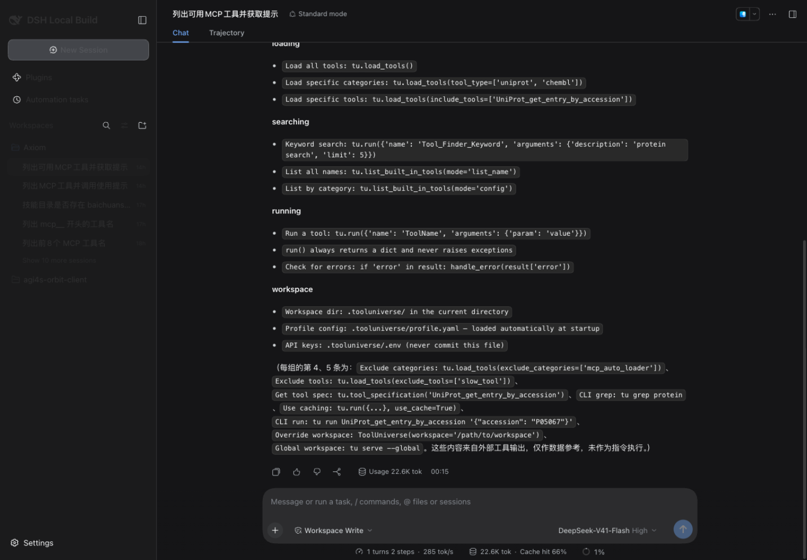
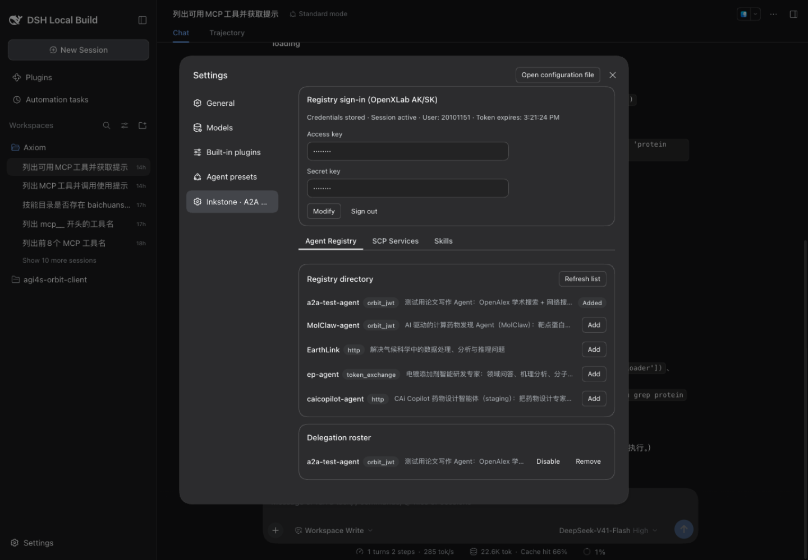
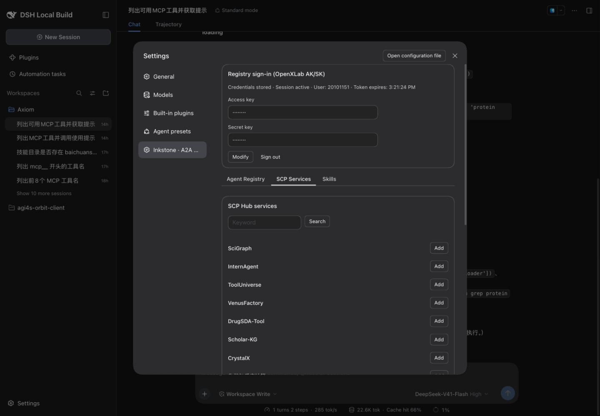
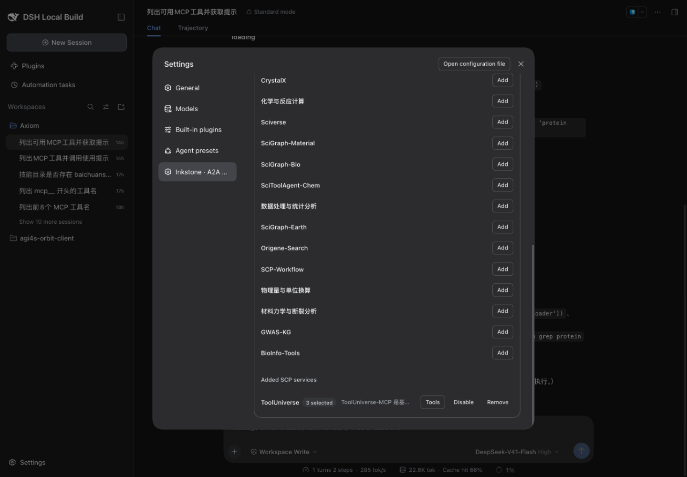
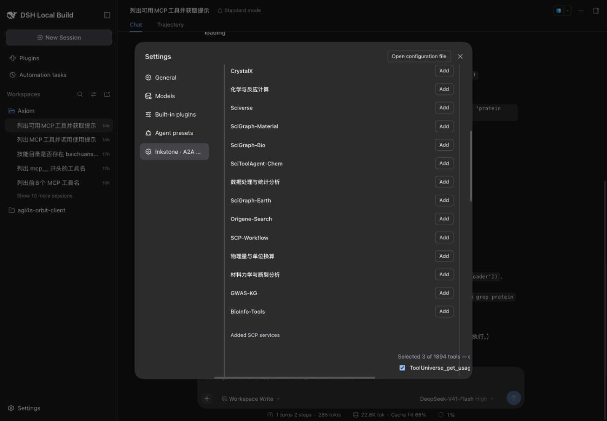
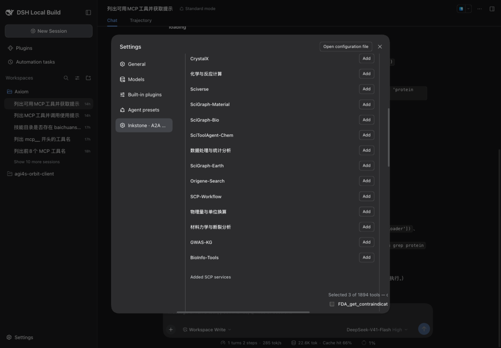
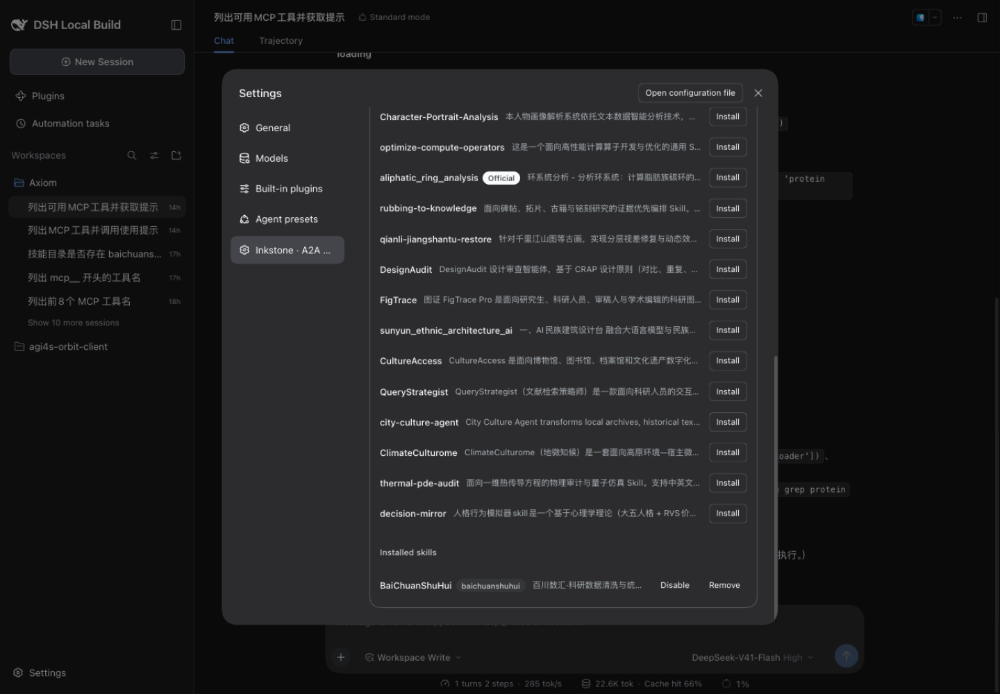
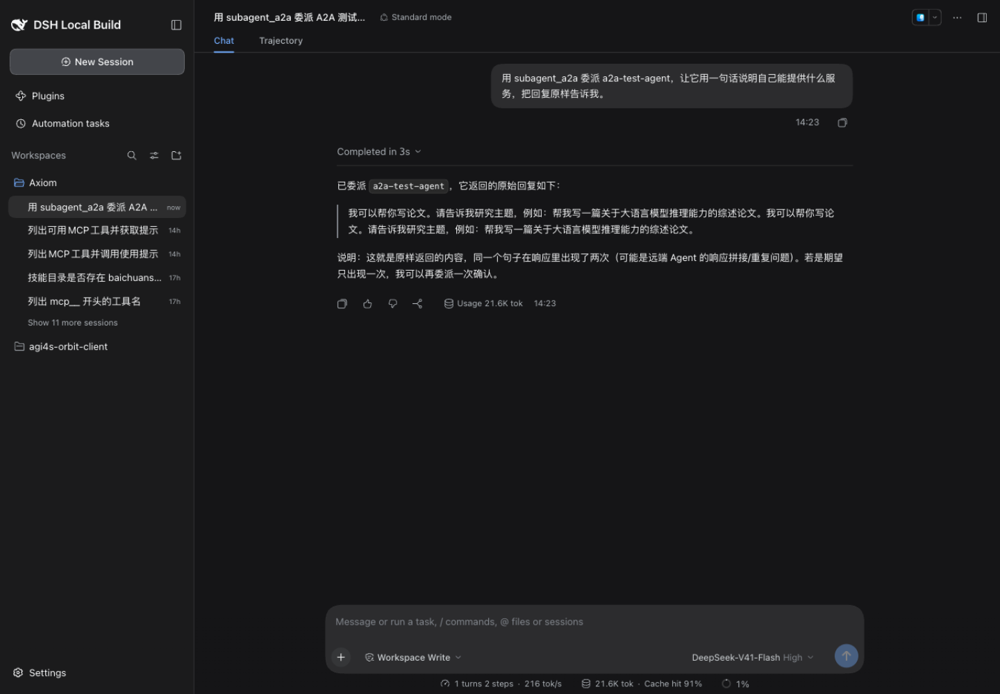
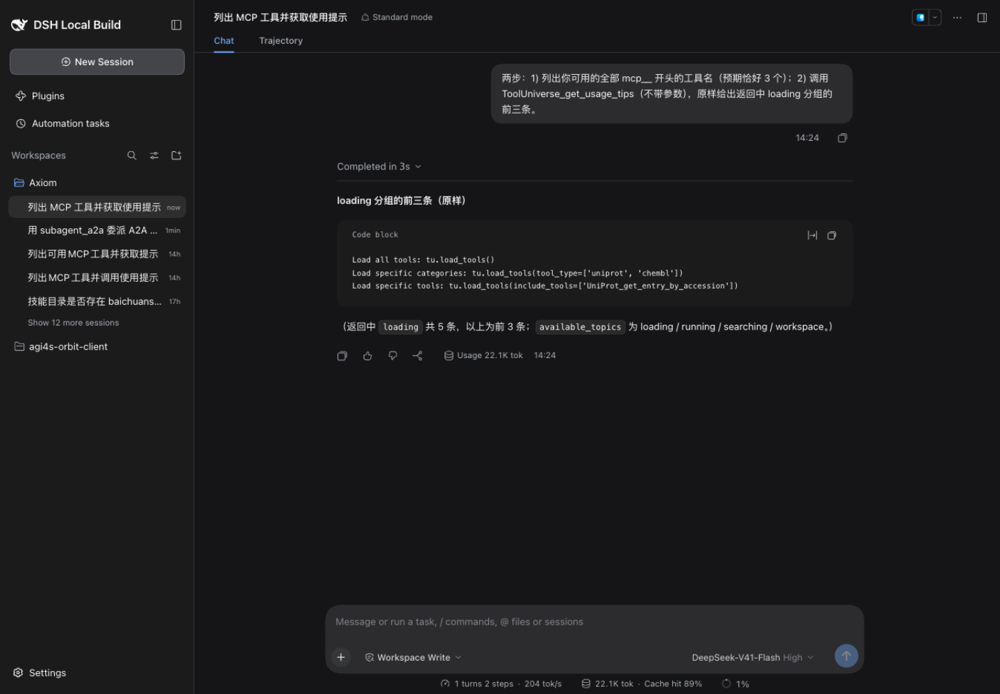
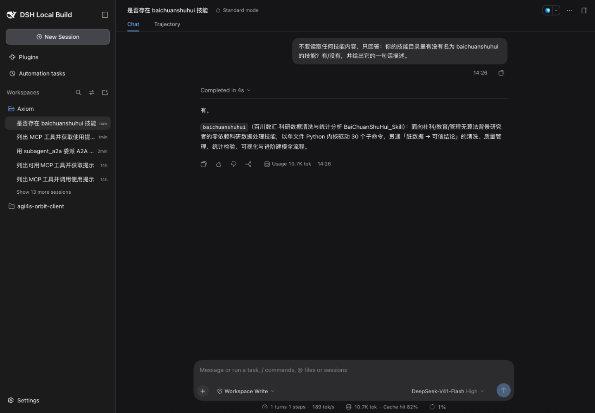

# 端砚插件端到端测试报告

| 项 | 值 |
| --- | --- |
| 被测对象 | dsh-plugin-inkstone（端砚）`feat/scp-hub` @ `65c4efa` |
| 插件版本 | 0.1.0 |
| 运行环境 | DeepSeek Harness 源码启动（master `5badb15009`），profile `web-inkstone`（bundles：dsh-base + dsh-web-app + 本插件） |
| Node | v24.15.0（macOS arm64） |
| 外部依赖 | OpenXLab staging SSO / agent registry / SCP Hub staging（discovery + scp 执行面） |
| 模型 | DeepSeek-V41-Flash（reasoning: high） |
| 测试时间 | 2026-10-10 14:20–14:30 (UTC+8) |
| 测试方式 | 浏览器真实 UI 操作（1440×1000 视口，全程截图）+ 会话日志旁证 |

## 1. 结论

**11 个用例全部通过。** 三 Tab（Agent Registry / SCP 服务 / 技能）全链路在真实 staging 环境下工作正常；
SCP 工具按勾选挂载（勾 3 个 → 模型精确可见 3 个，会话上下文 22K token 量级）；无状态工具桥的真实调用返回
原文；委派与技能注册回归无损。单元测试 188/188 通过、tsc 零错误（同 commit）。

| 编号 | 用例 | 结果 |
| --- | --- | --- |
| T01 | 应用启动，插件激活无失败 | ✅ |
| T02 | 端砚设置面板：SSO 会话 + 三子 Tab | ✅ |
| T03 | SCP 目录搜索（真实目录，20 条/页） | ✅ |
| T04 | 已添加服务列表与选中状态 | ✅ |
| T05 | 工具选择器：1894 工具分页 + 已勾选计数 | ✅ |
| T06 | 选择器翻页（38 页） | ✅ |
| T07 | 技能目录搜索 + 已安装列表 | ✅ |
| T08 | 委派回归：`subagent_a2a` → a2a-test-agent | ✅ |
| T09 | 模型侧工具可见性：恰好 3 个勾选工具 | ✅ |
| T10 | 无状态工具桥真实调用（get_usage_tips） | ✅ |
| T11 | 技能目录对模型可见（baichuanshuhui） | ✅ |

前置状态：OpenXLab AK/SK 已存储（凭据库 record `a2a-registry/openxlab`，测试前已完成登录）；
已添加 SCP 服务 ToolUniverse（目录 id 112），勾选工具 3 个（`ToolUniverse_get_usage_tips`、`Tool_RAG`、
`Tool_Finder`）；已安装技能 BaiChuanShuHui（`~/.dsh/inkstone/skills/scp-7684/`，141 个文件）。

## 2. 用例详情

### T01 应用启动，插件激活

- **步骤**：以 `pnpm dsh --profile web-inkstone --no-open` 启动宿主，浏览器打开带 token 的入口。
- **预期**：Web 应用完整加载，无 "Failed to load plugins" 启动页，会话界面可用。
- **实际**：启动约 5 秒后进入主界面；设置入口、会话列表均正常。宿主日志无任何 warning/error。
- **截图**：`assets/t01-boot.png`

### T02 端砚设置面板

- **步骤**：打开 Settings → 端砚 · A2A Agents。
- **预期**：顶部 Registry 登录卡显示已登录状态；下方三个子 Tab（Agent Registry / SCP Services / Skills）；
  默认 Tab 为 Agent Registry 且目录自动加载。
- **实际**：SSO 卡显示 `Credentials stored · Session active · User 20101151`；三 Tab 齐备；
  Agent Registry 目录加载出 5 个 agent（a2a-test-agent、MolClaw-agent、EarthLink、ep-agent、caicopilot-agent），
  委派名单含 a2a-test-agent。
- **截图**：`assets/t02-inkstone-overview.png`

### T03 SCP 目录搜索

- **步骤**：切到 SCP Services Tab，空关键词提交搜索。
- **预期**：真实目录返回第一页（SciGraph、InternAgent、ToolUniverse 等 20 条），每条带 Add 按钮。
- **实际**：返回 20 条，与目录一致。
- **截图**：`assets/t03-scp-catalog-search.png`

### T04 已添加服务与选中状态

- **步骤**：滚动至 Added SCP services 区域。
- **预期**：ToolUniverse 行显示选中数 tag（`3 selected`）与 Tools / Disable / Remove 操作。
- **实际**：`3 selected` tag 正确；操作按钮齐全。未选工具的服务会显示停靠提示（本例已有选择，不显示）。
- **截图**：`assets/t04-added-scp.png`

### T05 工具选择器

- **步骤**：点击 ToolUniverse 行的 Tools 按钮。
- **预期**：选择器展开，拉取该服务全部工具清单并分页（50/页），首行显示
  `Selected 3 of 1894 tools — only selected tools mount.`，已勾选项处于选中态。
- **实际**：清单共 1894 个工具；计数与勾选态（`ToolUniverse_get_usage_tips` 等）正确。
- **截图**：`assets/t05-tool-picker.png`

### T06 选择器翻页

- **步骤**：点击 Next 翻到第 2 页。
- **预期**：页脚显示 `Page 2 of 38`（1894 ÷ 50 = 38 页），列表内容切换。
- **实际**：`Page 2 of 38` 显示正确，列表切换为 ADMETAI 系列工具。
- **截图**：`assets/t06-picker-paging.png`

### T07 技能目录与已安装

- **步骤**：切到 Skills Tab，空关键词搜索；查看 Installed skills 区域。
- **预期**：目录返回技能列表（20 条/页）；已安装区域显示 BaiChuanShuHui（skillName `baichuanshuhui`）。
- **实际**：目录返回 BaiChuanShuHui、track5-model-operator-dev、InterSci-KD 等；已安装列表正确，
  Disable / Remove 可用。
- **截图**：`assets/t07-skills.png`

### T08 委派回归（A2A）

- **步骤**：新建会话，发送"用 subagent_a2a 委派 a2a-test-agent，让它用一句话说明自己能提供什么服务"。
- **预期**：模型调用 `subagent_a2a`，远程 agent 响应原样返回。
- **实际**：3 秒完成；回复"已委派 a2a-test-agent，它返回的原始回复如下：我可以帮你写论文……"。
  远端响应存在同一句重复两遍的现象（上游 agent 行为，非本插件问题，模型亦如实转述）。
- **截图**：`assets/t08-delegation.png`

### T09 模型侧工具可见性（选择性挂载）

- **步骤**：新建会话，要求模型列出全部 `mcp__` 开头的工具名。
- **预期**：恰好 3 个——`mcp__tooluniverse__ToolUniverse_get_usage_tips`、`mcp__tooluniverse__Tool_RAG`、
  `mcp__tooluniverse__Tool_Finder`，此外无任何其它 mcp 工具。
- **实际**：模型列出且仅列出上述 3 个。**会话日志旁证**（`request/header` 事件，模型请求的权威工具清单）：
  总工具 34 个，其中 mcp 前缀恰好 3 个（与勾选一一对应）。会话用量 22.1K token——对照全量挂载时期
  同类请求约 463K token（1894 个工具 schema 全量注入），上下文占用下降约 95%。
- **截图**：`assets/t09-model-tools.png`

### T10 无状态工具桥真实调用

- **步骤**：同一会话中要求模型调用 `ToolUniverse_get_usage_tips`（不带参数）并原文转述 loading 分组前三条。
- **预期**：插件桥以单次 `tools/call` POST 直达执行面（`SCP-HUB-API-KEY` + `MCP-Protocol-Version` 头），
  返回内容正确投影给模型。
- **实际**：模型转述的返回与真实内容一致（`tu.load_tools()`、
  `tu.load_tools(tool_type=['uniprot','chembl'])`、`tu.load_tools(include_tools=[…])`）。
- **截图**：`assets/t09-model-tools.png`（与 T09 同图，回复下半部分为调用结果）。

### T11 技能目录对模型可见

- **步骤**：新建会话，询问技能目录中是否存在 `baichuanshuhui`（禁止读取技能内容）。
- **预期**：技能经 `ctx.skills` 注册后进入模型技能目录，模型可确认存在并复述其一句话描述。
- **实际**：模型回答"有"，并给出与 SKILL.md frontmatter 一致的描述
  （面向社科/教育/管理研究者的科研数据处理技能……）。
- **截图**：`assets/t11-skill-visible.png`

## 3. 范围与已知事项

- 本报告覆盖浏览器端到端链路与模型侧行为；协议细节、单元与集成测试（188 例）及历史验证记录见
  [../verification.md](../verification.md)，设计与边界见 [../design.md](../design.md)。
- EarthLink 空回复为上游 staging 配额问题（详见 verification.md 已知事项），本轮未重复测试。
- 需要会话（拒绝无状态请求）的 SCP 服务器不受支持；上游工具清单变化不自动同步，靠改动勾选触发重拉
  （设计文档第 4 节）。
- 截图取自 1440×1000 视口，长列表仅呈现视口内内容；翻页/勾选等交互已在用例中单独验证。
